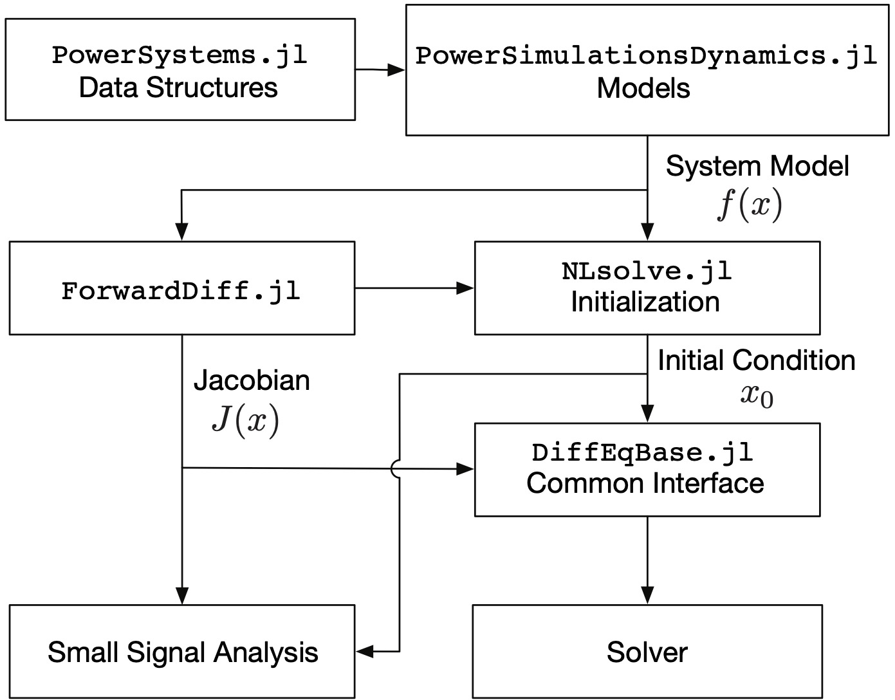

# PowerSimulationsDynamics.jl

```@meta
CurrentModule = PowerSimulationsDynamics
```

## Overview

`PowerSimulationsDynamics.jl` is a [`Julia`](http://www.julialang.org) package for
doing Power Systems Dynamic Modeling with Low Inertia Energy Sources.

The synchronous machine components supported here are based on commercial models and
the academic components are derived from [Power System Modelling and Scripting](https://www.springer.com/gp/book/9783642136689).

Inverter models support both commercial models, such as REPC, REEC and REGC type of models; and academic models obtained
from grid-following and grid-forming literature such as in ["A Virtual Synchronous Machine implementation for
distributed control of power converters in SmartGrids"](https://www.sciencedirect.com/science/article/pii/S0378779615000024)

The background work on `PowerSimulationsDynamics.jl` is explained in [Revisiting Power Systems Time-domain Simulation Methods and Models](https://arxiv.org/pdf/2301.10043.pdf)

```bibtex
@article{lara2023revisiting,
title={Revisiting Power Systems Time-domain Simulation Methods and Models},
author={Lara, Jose Daniel and Henriquez-Auba, Rodrigo and Ramasubramanian, Deepak and Dhople, Sairaj and Callaway, Duncan S and Sanders, Seth},
journal={arXiv preprint arXiv:2301.10043},
year={2023}
}
```

## Installation

The latest stable release of PowerSimulationsDynamics.jl can be installed using the Julia package manager with

```julia
] add PowerSimulationsDynamics
```

For the current development version, "checkout" this package with

```julia
] add PowerSimulationsDynamics#master
```

## Structure

The following figure shows the interactions between `PowerSimulationsDynamics.jl`, `PowerSystems.jl`, `ForwardDiff.jl`, `DiffEqBase.jl` and the integrators.
The architecture of `PowerSimulationsDynamics.jl`  is such that the power system models are
all self-contained and return the model function evaluations. The Jacobian is calculated
using automatic differentiation through `ForwardDiff.jl`, that is used for both numerical
integration and small signal analysis. Considering that the resulting models are differential-algebraic
equations (DAE), the implementation focuses on the use of implicit solvers, in particular
BDF and Rosenbrock methods.

```@raw html

``` ⠀

------------
PowerSimulationsDynamics.jl has been developed as part of the Scalable Integrated Infrastructure Planning
(SIIP) initiative at the U.S. Department of Energy's National Renewable Energy
Laboratory ([NREL](https://www.nrel.gov/))
