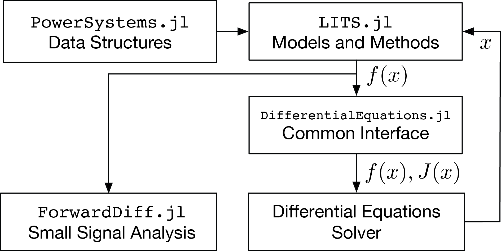

# LITS.jl


*LITS.jl* is a [`Julia`](http://www.julialang.org) package for doing Power Systems Dynamic Modeling with Low Inertia Energy Sources.

## Installation

You can install it by typing

```julia
pkg> add LITS
```

## Usage

Once installed, the `LITS` package can by used by typing:

```julia
using LITS
```

## Structure

The following figure shows the interactions between `LITS.jl`, `PowerSystems.jl`, `DifferentialEquations.jl` and the integrators.
The architecture of `LITS.jl`  is such that the power system models are all self-contained and return the model function evaluations. The Jacobian is calculated through `DifferentialEquations.jl`'s common-interface enabling the use of any solver available in Julia. Considering that the resulting models are differential-algebraic equations (DAE), the implementation focuses on the use of implicit solvers, in particular SUNDIALS since it has exceptional features applicable to large models — for instance, interfacing with distributed linear-solvers and GPU arrays.

```@raw html

``` ⠀

## Contents

```@contents
Pages = [
  "Examples/example_OMIB.md",
  "Examples/example_lines.md",
  "Models/network.md",
  "Models/gens.md",
  "Models/inverters.md",
]
```
