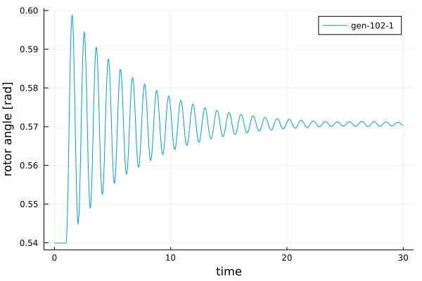
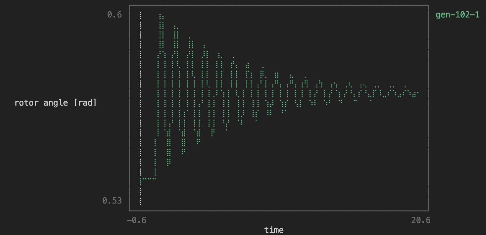

# Quick Start Guide

You can access example data in the [Power Systems Test Data Repository](https://github.com/NREL-SIIP/PowerSystemsTestData),
the data can be downloaded with the `PowerSystems.jl` submodule `UtilsData`. Some systems are already provided in PowerSystemCaseBuilder.

## Loading data

Data can be loaded from a pss/e raw file and a pss/e dyr file.

```@repl quick_start_guide
using PowerSystems, PowerSimulationsDynamics, PowerSystemCaseBuilder, Sundials, Plots, Logging
logger = configure_logging(console_level = Logging.Error, file_level = Logging.Info)
omib_sys = PowerSystemCaseBuilder.build_system(
                PowerSystemCaseBuilder.PSSETestSystems,
                "psse_OMIB_sys",
                )
```

For more details about loading data and adding more dynamic components check the
[Creating a System with Dynamic devices](https://nrel-siip.github.io/PowerSystems.jl/stable/modeler_guide/system_dynamic_data/)
section of the documentation in `PowerSystems.jl`.

## Define the Simulation

```@repl quick_start_guide
time_span = (0.0, 30.0)
perturbation_trip = BranchTrip(1.0, Line, "BUS 1-BUS 2-i_1")
sim = Simulation!(ResidualModel, omib_sys, pwd(), time_span, perturbation_trip)
```

## Explore initial conditions for the simulation

```@repl quick_start_guide
x0_init = read_initial_conditions(sim)
```

```@repl quick_start_guide
show_states_initial_value(sim)
```

## Obtain small signal results for initial conditions

```@repl quick_start_guide
    small_sig = small_signal_analysis(sim)
```

Show eigenvalues for operating point
```@repl quick_start_guide
    small_sig.eigenvalues
```

Show reduced jacobian for operating point
```@repl quick_start_guide
    small_sig.reduced_jacobian
```

Explore participation factors. In this case for state ω
```@repl quick_start_guide
    part_factors = small_sig.participation_factors
    part_factors["generator-102-1"][:ω]
```
This means that the state ω of the generator at bus 102, participates 50% in eigenvalue 1 and 50% in eigenvalue 2.

## Execute the simulation

```@repl quick_start_guide
    execute!(sim, IDA(), dtmax = 0.02, saveat = 0.02)
```

## Make a plot of the results

```@repl quick_start_guide
results = read_results(sim)
angle = get_state_series(results, ("generator-102-1", :δ));
plot(angle, xlabel = "time", ylabel = "rotor angle [rad]", label = "gen-102-1");
```



If you miss PSS/e's plotting aesthetics and want something that resembles that, you can use [`UnicodePlots`](https://github.com/Evizero/UnicodePlots.jl).

```@repl quick_start_guide
using UnicodePlots
unicodeplots()
plot(angle, xlabel = "time", ylabel = "rotor angle [rad]", label = "gen-102-1");
```


