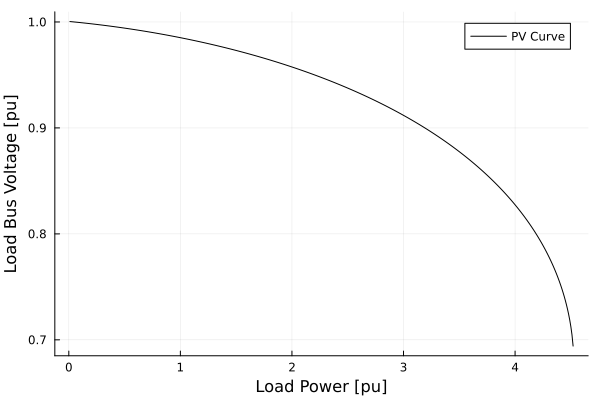

# Tutorial Small Signal Analysis with Continuation Power Flow

**Originally Contributed by**: Rodrigo Henriquez-Auba

## Introduction

This tutorial will introduce you to the functionality of `PowerSimulationsDynamics` and `PowerFlows`
for running small signal analysis in a continuation power flow.

This tutorial presents a simulation of a two-bus system with a generator (represented with a GENROU + SEXS + TGOV1 model) at bus 1, and a load on bus 2. We will increase the load demand to observe the P-V curve and run a small-signal analysis to check if the system satisfies small-signal stability at different operating points.

## Dependencies

```@repl tutorial_pf
using PowerSimulationsDynamics
PSID = PowerSimulationsDynamics
using PowerSystemCaseBuilder
using PowerSystems
using PowerFlows
const PSY = PowerSystems
using Plots
gr()

# Disable Logging to avoid excessive information
using Logging
Logging.disable_logging(Logging.Info); 
Logging.disable_logging(Logging.Warn); 
```

!!! note
    `PowerSystemCaseBuilder.jl` is a helper library that makes it easier to reproduce examples in the documentation and tutorials. Normally you would pass your local files to create the system data instead of calling the function `build_system`.
    For more details visit [PowerSystemCaseBuilder Documentation](https://nrel-sienna.github.io/PowerSystems.jl/stable/tutorials/powersystembuilder/)

`PowerSystems` (abbreviated with `PSY`) is used to properly define the data structure and establish an equilibrium point initial condition with a power flow routine using `PowerFlows`.

## Load the system

We load the system using `PowerSystemCaseBuilder.jl`. This system only have a generator without dynamic data on which we can use `PowerFlows` to generate a P-V (or nose) curve.

```@repl tutorial_pf
sys_static = build_system(PSIDSystems, "2 Bus Load Tutorial")
```

Note that this system contains an Exponential Load, but the parameters are set up to zero, so it behaves a Constant Power Load:

```@repl tutorial_pf
first(get_components(PSY.ExponentialLoad, sys_static))
```

## Create a P-V curve

The next step is to run multiple power flows and store the voltage at the load and the active power. For this example we will set up the power factor to be unitary (i.e. no reactive power at the load). 

```@repl tutorial_pf
# Create a Power Range to change the power load active power
P_range = 0.01:0.01:4.6;
# Choose the power factor
load_pf = 1.0;
```

Then create vectors to store the results

```@repl tutorial_pf
# PV Curve Results
P_load_p = Vector{Float64}();
V_load_p = Vector{Float64}();
```

Then, we run multiple power flows in a for loop by changing the active power of the load:

```@repl tutorial_pf
for p in P_range
    # Change the active power and reactive power of the load
    power = p * 1.0
    load = get_component(PSY.ExponentialLoad, sys_static, "load1021")
    set_active_power!(load, power)
    q_power = power * tan(acos(load_pf))
    set_reactive_power!(load, q_power)
    # Run Power Flow
    pf = ACPowerFlow()
    status = solve_powerflow!(pf, sys_static)
    if !status
        # Finish the loop if the power flow fails
        print("Power Flow failed at p = $(power)")
        break
    end
    # Obtain the bus voltage information
    bus = get_component(Bus, sys_static, "BUS 2")
    Vm = get_magnitude(bus)
    # Store values in the vectors
    push!(V_load_p, Vm)
    push!(P_load_p, power)
end
```

The plot can be visualized with:

```@repl tutorial_pf
plot(P_load_p,
     V_load_p,
     label = "PV Curve",
     xlabel = "Load Power [pu]",
     ylabel = "Load Bus Voltage [pu]",
     color = :black
)
```



## Run Small-Signal Analysis besides the Continuation Power Flow

To run a small-signal analysis we require a dynamic model of the machine. We can use `PowerSystemCaseBuilder` to the load the same system, but with a dynamic model for the generator, including a GENROU + SEXS exciter + TGOV1 governor.

```@repl tutorial_pf
sys = build_system(PSIDSystems, "2 Bus Load Tutorial GENROU")
```

Here are the components of the generator:

```@repl tutorial_pf
first(get_components(DynamicGenerator, sys))
```

Besides the results of the P-V curve, we need to store if the system is small-signal stable or not by looking if there is a positive real part eigenvalue.

```@repl tutorial_pf
# Vectors to store stability using a boolean (true for stable).
stable_vec = Vector{Bool}();
status_vec = Vector{Bool}();

# PV Curve Results
P_load_p = Vector{Float64}();
V_load_p = Vector{Float64}();
```

We then run the main for loop by updating the load active power, but in addition we create a PowerSimulationsDynamics simulation on which we can run a small-signal analysis to check stability.

```@repl tutorial_pf
for p in P_range
    # Change the active power and reactive power of the load
    power = p * 1.0
    load = get_component(PSY.ExponentialLoad, sys_static, "load1021")
    set_active_power!(load, power)
    q_power = power * tan(acos(load_pf))
    set_reactive_power!(load, q_power)
    # Run Power Flow
    pf = ACPowerFlow()
    status = solve_powerflow!(pf, sys_static)
    if !status
        # Finish the loop if the power flow fails
        print("Power Flow failed at p = $(power)")
        break
    end
    # Obtain the bus voltage information
    bus = get_component(Bus, sys_static, "BUS 2")
    Vm = get_magnitude(bus)
    # Store values in the vectors
    push!(V_load_p, Vm)
    push!(P_load_p, power)

    # Update Load Power in the GENROU system
    load = get_component(PSY.ExponentialLoad, sys, "load1021")
    set_active_power!(load, power)
    q_power = power * tan(acos(load_pf))
    set_reactive_power!(load, q_power)
    # Construct Simulation
    sim = Simulation(ResidualModel, sys, mktempdir(), (0.0, 1.0))
    if sim.status == PSID.BUILT
        # Check small-signal stability
        sm = small_signal_analysis(sim).stable
        # Push results of small-signal stability
        push!(stable_vec, sm)
        # Push results if the simulation was able to be constructed
        push!(status_vec, true)
    else
        # Push results if the simulation was not able to be constructed
        push!(status_vec, false)
    end
end
```

The following plot showcases the P-V curve, while also showcasing (in red) the regions on which the system is small-signal stable.

```@repl tutorial_pf

# Find where is stable and unstable
dict_true_ixs_p = Vector();
dict_false_ixs_p = Vector();
dict_true_ixs_p = findall(x->x, stable_vec);
dict_false_ixs_p = findall(x->!x, stable_vec);

# Create plot
true_ixs = dict_true_ixs_p;
plot(P_load_p, V_load_p, color = :blue, label = "PV Curve", xlabel = "Load Power [pu]", ylabel = "Load Bus Voltage [pu]")
plot!(Plots.scatter!(P_load_p[true_ixs] , V_load_p[true_ixs], markerstrokewidth= 0, label = "GENROU SSA"))
```


This results is consistent with most of the literature for dynamic generator models supplying constant power loads, on which by increasing the active power of the load, produce critical eigenvalues which cross the ``j\omega`` axis at some point. This is called a Hopf Bifurcation, in this case a subcritical one since the limit cycles are unstable.