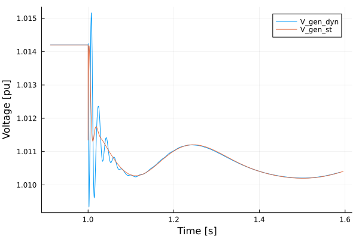

# Line Modeling simulation with [PowerSimulationsDynamics.jl](https://github.com/NREL-Sienna/PowerSimulationsDynamics.jl)

**Originally Contributed by**: Rodrigo Henriquez-Auba and José Daniel Lara

## Introduction

This tutorial will introduce an example of considering dynamic lines in `PowerSimulationsDynamics`.

This tutorial presents a simulation of a three-bus system, with an infinite bus (represented as a voltage source behind an impedance) at bus 1, a one d- one q- machine on bus 2 and an inverter of 19 states, as a virtual synchronous machine at bus 3. The perturbation will be the trip of two of the three circuits (triplicating its resistance and impedance) of the line that connects bus 1 and bus 3. This case also consider a dynamic line model for connection between buses 2 and 3. We will compare it against a system without dynamic lines.

It is recommended to check the OMIB tutorial first, since that includes more details and explanations on all definitions and functions.

### Step 1: Package Initialization

```@repl dyn_lines
using PowerSimulationsDynamics
using PowerSystems
using PowerNetworkMatrices
using PowerSystemCaseBuilder
using Sundials
using Plots
```

!!! note
    `PowerSystemCaseBuilder.jl` is a helper library that makes it easier to reproduce examples in the documentation and tutorials. Normally you would pass your local files to create the system data instead of calling the function `build_system`.

### Step 2: Data creation

```@repl dyn_lines
threebus_sys = build_system(PSIDTestSystems, "Three Bus Dynamic data Example System")
```

In addition, we will create a new copy of the system on which we will simulate the same case, but will consider dynamic lines:

```@repl dyn_lines
threebus_sys_dyn = deepcopy(threebus_sys);
```

### Step 3: Create the fault and simulation on the Static Lines system

First, we construct the perturbation, by properly computing the new Ybus on the system:

```@repl dyn_lines
#Make a copy of the original system
sys2 = deepcopy(threebus_sys)
#Triplicates the impedance of the line named "BUS 1-BUS 3-i_1"
fault_branches = get_components(ACBranch, sys2)
for br in fault_branches
    if get_name(br) == "BUS 1-BUS 3-i_1"
        br.r = 3 * br.r
        br.x = 3 * br.x
        b_new = (from = br.b.from / 3, to = br.b.to / 3)
        br.b = b_new
    end
end
#Obtain the new Ybus
Ybus_fault = Ybus(sys2).data
#Define Fault: Change of YBus
Ybus_change = NetworkSwitch(
    1.0, #change at t = 1.0
    Ybus_fault, #New YBus
);
```

Now, we construct the simulation:

```@repl dyn_lines
#Time span of our simulation
tspan = (0.0, 30.0)

#Define Simulation
sim = Simulation(
    ResidualModel, #Type of model used
    threebus_sys, #system
    pwd(), #folder to output results
    tspan, #time span
    Ybus_change, #Type of perturbation
)
```

We can obtain the initial conditions as:

```@repl dyn_lines
#Will print the initial states. It also give the symbols used to describe those states.
show_states_initial_value(sim)
```

### Step 4: Run the simulation of the Static Lines System

```@repl dyn_lines
#Run the simulation
execute!(
    sim, #simulation structure
    IDA(), #Sundials DAE Solver
    dtmax = 0.02, #Maximum step size
)
```

### Step 5: Store the solution

```@repl dyn_lines
results = read_results(sim)
series2 = get_voltage_magnitude_series(results, 102)
zoom = [
    (series2[1][ix], series2[2][ix]) for
    (ix, s) in enumerate(series2[1]) if (s > 0.90 && s < 1.6)
];
```

### Step 3.1: Create the fault and simulation on the Dynamic Lines system

An important aspect to consider is that DynamicLines must not be considered in the computation of the Ybus. First we construct the Dynamic Line, by finding the Line named "BUS 2-BUS 3-i_1", and then adding it to the system.

```@repl dyn_lines
# get component return the Branch on threebus_sys_dyn named "BUS 2-BUS 3-i_1"
dyn_branch = DynamicBranch(get_component(Line, threebus_sys_dyn,"BUS 2-BUS 3-i_1"))
# Adding a dynamic line will immediately remove the static line from the system.
add_component!(threebus_sys_dyn, dyn_branch)
```

Similarly, we construct the Ybus fault by creating a copy of the original system, but removing the Line "BUS 2-BUS 3-i_1" to avoid considering it in the Ybus:

```@repl dyn_lines
#Make a copy of the original system
sys3 = deepcopy(threebus_sys);
#Remove Line "BUS 2-BUS 3-i_1"
remove_component!(Line, sys3, "BUS 2-BUS 3-i_1")
#Triplicates the impedance of the line named "BUS 1-BUS 2-i_1"
fault_branches2 = get_components(Line, sys3)
for br in fault_branches2
    if get_name(br) == "BUS 1-BUS 3-i_1"
        br.r = 3 * br.r
        br.x = 3 * br.x
        b_new = (from = br.b.from / 3, to = br.b.to / 3)
        br.b = b_new
    end
end
#Obtain the new Ybus
Ybus_fault_dyn = Ybus(sys3).data
#Define Fault: Change of YBus
Ybus_change_dyn = NetworkSwitch(
    1.0, #change at t = 1.0
    Ybus_fault_dyn, #New YBus
)
```

### Step 4.1: Run the simulation of the Dynamic Lines System

Now, we construct the simulation:

```@repl dyn_lines
# Define Simulation
sim_dyn = Simulation(
    ResidualModel, #Type of model used
    threebus_sys_dyn, #system
    pwd(), #folder to output results
    (0.0, 30.0), #time span
    Ybus_change_dyn, #Type of perturbation
)
```

```@repl dyn_lines
# Run the simulation
execute!(
    sim_dyn, #simulation structure
    IDA(), #Sundials DAE Solver
    dtmax = 0.02, #Maximum step size
)
```

We can obtain the initial conditions as:

```@repl dyn_lines
#Will print the initial states. It also give the symbols used to describe those states.
show_states_initial_value(sim_dyn)
```

### Step 5.1: Store the solution

```@repl dyn_lines
results_dyn = read_results(sim_dyn)
series2_dyn = get_voltage_magnitude_series(results_dyn, 102);
zoom_dyn = [
    (series2_dyn[1][ix], series2_dyn[2][ix]) for
    (ix, s) in enumerate(series2_dyn[1]) if (s > 0.90 && s < 1.6)
];
```

# Step 6.1: Compare the solutions:

We can observe the effect of Dynamic Lines

```@repl dyn_lines
plot(series2_dyn, label = "V_gen_dyn");
plot!(series2, label = "V_gen_st", xlabel = "Time [s]", ylabel = "Voltage [pu]");
```


that looks quite similar. The differences can be observed in the zoom plot:

```@repl dyn_lines
plot(zoom_dyn, label = "V_gen_dyn");
plot!(zoom, label = "V_gen_st", xlabel = "Time [s]", ylabel = "Voltage [pu]");
```


