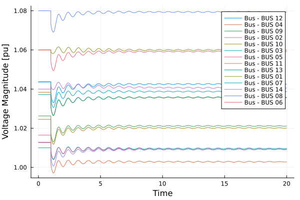
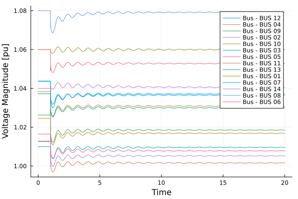

# Inverter Modeling simulation

**Originally Contributed by**: José Daniel Lara

## Introduction

This tutorial will introduce the modeling of an inverter with Virtual Inertia in a multi-machine model of the system. We will load the data directly from PSS/e dynamic files.

The tutorial uses a modified 14-bus system on which all the synchronous machines have been substituted by generators with ESAC1A AVR's and no Turbine Governors.

In the first portion of the tutorial we will simulate the system with the original data and cause a line trip between Buses 2 and 4. In the second part of the simulation, we will switch generator 6 with a battery using an inverter and perform the same fault.

### Load the packages

```@repl inv_sys
using PowerSimulationsDynamics
using PowerSystemCaseBuilder
using PowerSystems
const PSY = PowerSystems
using PowerFlows
using Logging
using Sundials
using Plots
```

!!! note
    `PowerSystemCaseBuilder.jl` is a helper library that makes it easier to reproduce examples in the documentation and tutorials. Normally you would pass your local files to create the system data instead of calling the function `build_system`.
    For more details visit [PowerSystemCaseBuilder Documentation](https://nrel-sienna.
    github.io/PowerSystems.jl/stable/tutorials/powersystembuilder/)

Create the system using `PowerSystemCaseBuilder.jl`:

```@repl inv_sys
sys = build_system(PSIDSystems, "14 Bus Base Case")
```

`PowerSystemCaseBuilder.jl` is a helper library that makes it easier to reproduce examples in the documentation and tutorials. Normally you would pass your local files to create the system data.

Define Simulation Problem with a 20 second simulation period and the branch trip at t = 1.0:

```@repl inv_sys
sim = Simulation(
    ResidualModel, #Type of model used
    sys,         #system
    mktempdir(),       #path for the simulation output
    (0.0, 20.0), #time span
    BranchTrip(1.0, Line, "BUS 02-BUS 04-i_1");
    console_level = Logging.Info,
)
```

Now that the system is initialized, we can verify the system states for potential issues.

```@repl inv_sys
show_states_initial_value(sim)
```

We execute the simulation with an additional tolerance for the solver set at 1e-8:

```@repl inv_sys
execute!(sim, IDA(); abstol = 1e-8)
```

Using `PowerSimulationsDynamics` tools for exploring the results, we can plot all the voltage results for the buses:

```@repl inv_sys
result = read_results(sim)
p = plot();
for b in get_components(Bus, sys)
    voltage_series = get_voltage_magnitude_series(result, get_number(b))
    plot!(
        p,
        voltage_series;
        xlabel = "Time",
        ylabel = "Voltage Magnitude [pu]",
        label = "Bus - $(get_name(b))",
    );
end
```



We can also explore the frequency of the different generators

```@repl inv_sys
p2 = plot();
for g in get_components(ThermalStandard, sys)
    state_series = get_state_series(result, (get_name(g), :ω))
    plot!(
        p2,
        state_series;
        xlabel = "Time",
        ylabel = "Speed [pu]",
        label = "$(get_name(g)) - ω",
    );
end
```


It is also possible to explore the small signal stability of this system we created.

```@repl inv_sys
res = small_signal_analysis(sim)
```

## The eigenvalues can be explored

```@repl inv_sys
res.eigenvalues
```

## Modifying the system and adding storage

Reload the system for this example:

```@repl inv_sys
sys = build_system(PSIDSystems, "14 Bus Base Case")

# We want to remove the generator 6 and the dynamic component attached to it.
thermal_gen = get_component(ThermalStandard, sys, "generator-6-1")
remove_component!(sys, get_dynamic_injector(thermal_gen))
remove_component!(sys, thermal_gen)

# We can now define our storage device and add it to the system
storage = GenericBattery(
    name = "Battery",
    bus = get_component(Bus, sys, "BUS 06"),
    available = true,
    prime_mover = PrimeMovers.BA,
    active_power = 0.6,
    reactive_power = 0.16,
    rating = 1.1,
    base_power = 25.0,
    initial_energy = 50.0,
    state_of_charge_limits = (min = 5.0, max = 100.0),
    input_active_power_limits = (min = 0.0, max = 1.0),
    output_active_power_limits = (min = 0.0, max = 1.0),
    reactive_power_limits = (min = -1.0, max = 1.0),
    efficiency = (in = 0.80, out = 0.90),
)

add_component!(sys, storage)
```

A good sanity check it running a power flow on the system to make sure all the components are properly scaled and that the system is properly balanced. We can use `PowerSystems` to perform this check. We can get the results back and perform a sanity check.

```@repl inv_sys
res = run_powerflow(sys)
res["bus_results"]
```

After verifying that the system works, we can define our inverter dynamics and add it to the battery that has already been stored in the system.

```@repl inv_sys
inverter = DynamicInverter(
    name = get_name(storage),
    ω_ref = 1.0, # ω_ref,
    converter = AverageConverter(rated_voltage = 138.0, rated_current = 100.0),
    outer_control = OuterControl(
        VirtualInertia(Ta = 2.0, kd = 400.0, kω = 20.0),
        ReactivePowerDroop(kq = 0.2, ωf = 1000.0),
    ),
    inner_control = VoltageModeControl(
        kpv = 0.59,     #Voltage controller proportional gain
        kiv = 736.0,    #Voltage controller integral gain
        kffv = 0.0,     #Binary variable enabling the voltage feed-forward in output of current controllers
        rv = 0.0,       #Virtual resistance in pu
        lv = 0.2,       #Virtual inductance in pu
        kpc = 1.27,     #Current controller proportional gain
        kic = 14.3,     #Current controller integral gain
        kffi = 0.0,     #Binary variable enabling the current feed-forward in output of current controllers
        ωad = 50.0,     #Active damping low pass filter cut-off frequency
        kad = 0.2,
    ),
    dc_source = FixedDCSource(voltage = 600.0),
    freq_estimator = KauraPLL(
        ω_lp = 500.0, #Cut-off frequency for LowPass filter of PLL filter.
        kp_pll = 0.084,  #PLL proportional gain
        ki_pll = 4.69,   #PLL integral gain
    ),
    filter = LCLFilter(lf = 0.08, rf = 0.003, cf = 0.074, lg = 0.2, rg = 0.01),
)
add_component!(sys, inverter, storage)
```

These are the current system components:

```@repl inv_sys
sys
```

Define Simulation problem using the same parameters:

```@repl inv_sys
sim = Simulation(
    ResidualModel, #Type of model used
    sys,         #system
    mktempdir(),       #path for the simulation output
    (0.0, 20.0), #time span
    BranchTrip(1.0, Line, "BUS 02-BUS 04-i_1");
    console_level = Logging.Info,
)
```

We can verify the small signal stability of the system before running the simulation:

```@repl inv_sys
res = small_signal_analysis(sim)
```

Exploring the eigenvalues:

```@repl inv_sys
res.eigenvalues
```

We execute the simulation

```@repl inv_sys
execute!(sim, IDA(); abstol = 1e-8)
```

Using `PowerSimulationsDynamics` tools for exploring the results, we can plot all the voltage results for the buses

```@repl inv_sys
result = read_results(sim)
p = plot();
for b in get_components(Bus, sys)
    voltage_series = get_voltage_magnitude_series(result, get_number(b))
    plot!(
        p,
        voltage_series;
        xlabel = "Time",
        ylabel = "Voltage Magnitude [pu]",
        label = "Bus - $(get_name(b))",
    );
end
```



We can also explore the frequency of the different static generators and storage

```@repl inv_sys
p2 = plot();
for g in get_components(ThermalStandard, sys)
    state_series = get_state_series(result, (get_name(g), :ω))
    plot!(
        p2,
        state_series;
        xlabel = "Time",
        ylabel = "Speed [pu]",
        label = "$(get_name(g)) - ω",
    );
end
state_series = get_state_series(result, ("Battery", :ω_oc))
plot!(p2, state_series; xlabel = "Time", ylabel = "Speed [pu]", label = "Battery - ω");
```


