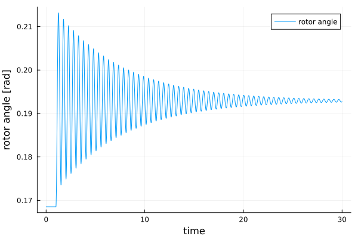
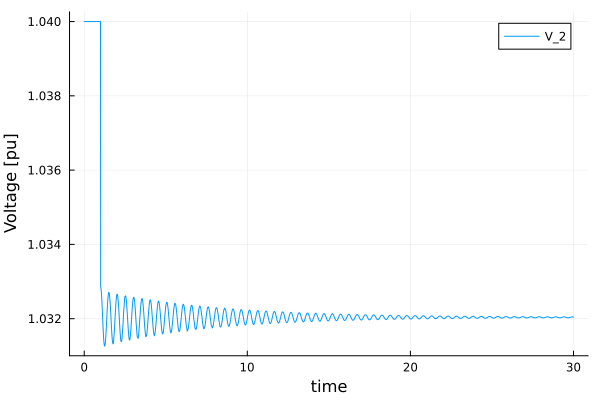

# One Machine against Infinite Bus (OMIB) simulation with [PowerSimulationsDynamics.jl](https://github.com/NREL-Sienna/PowerSimulationsDynamics.jl)

**Originally Contributed by**: Rodrigo Henriquez-Auba and José Daniel Lara

## Introduction

This tutorial will introduce you to the functionality of `PowerSimulationsDynamics`
for running power system dynamic simulations.

This tutorial presents a simulation of a two-bus system with an infinite bus (represented as a voltage source behind an impedance) at bus 1, and a classic machine on bus 2. The perturbation will be the trip of one of the two circuits (doubling its resistance and impedance) of the line that connects both buses.

## Dependencies

```@repl tutorial_omib
using PowerSimulationsDynamics
using PowerSystems
using Sundials
using Plots
gr()
PSID = PowerSimulationsDynamics
```

`PowerSystems` (abbreviated with `PSY`) is used to properly define the data structure and establish an equilibrium point initial condition with a power flow routine, while `Sundials` is used to solve the problem defined in `PowerSimulationsDynamics`.

## Load the system

```@repl tutorial_omib
file_dir = joinpath(pkgdir(PowerSimulationsDynamics), "docs", "src", "tutorials", "data")
omib_sys = System(joinpath(file_dir, "omib_sys.json"), runchecks = false)
```

## Build the simulation and initialize the problem

The next step is to create the simulation structure. This will create the indexing of our system that will be used to formulate the differential-algebraic system of equations. To do so, it is required to specify the perturbation that will occur in the system. `PowerSimulationsDynamics` supports multiple types of perturbations. See [`Perturbations`]()

Here, we will use a Branch Trip perturbation, that is modeled by modifying the specifying which line we want to trip. In this case we disconnect one of the lines that connects BUS 1 and BUS 2, named "BUS 1-BUS 2-i_1".

With this, we are ready to create our simulation structure:

```@repl tutorial_omib
time_span = (0.0, 30.0)
perturbation_trip = BranchTrip(1.0, Line, "BUS 1-BUS 2-i_1")
sim = PSID.Simulation(
    ResidualModel, # Type of formulation
    omib_sys, # System
    mktempdir(), # Output directory
    time_span,
    perturbation_trip)
```

This will automatically initialize the system by running a power flow and update `V_ref`, `P_ref` and hence `eq_p` (the internal voltage) to match the solution of the power flow. It will also initialize the states in the equilibrium, which can be printed with:

```@repl tutorial_omib
show_states_initial_value(sim)
```

## Run the Simulation

Finally, to run the simulation we simply use:

```@repl tutorial_omib
execute!(
    sim, #simulation structure
    IDA(), #Sundials DAE Solver
    dtmax = 0.02, #Arguments: Maximum timestep allowed
);
```

In some cases, the dynamic time step used for the simulation may fail. In such case, the keyword argument `dtmax` can be used to limit the maximum time step allowed for the simulation.

## Exploring the solution

First, we need to load the simulation results into memory:

```@repl tutorial_omib
results = read_results(sim)
```

`PowerSimulationsDynamics` has two functions to obtain different states of the solution:
 - `get_state_series(results, ("generator-102-1", :δ))`: can be used to obtain the solution as a tuple of time and the required state. In this case, we are obtaining the rotor angle `:δ` of the generator named "generator-102-1"`.

```@repl tutorial_omib
angle = get_state_series(results, ("generator-102-1", :δ));
plot(angle, xlabel = "time", ylabel = "rotor angle [rad]", label = "rotor angle")
```



 - `get_voltage_magnitude_series(results, 102)`: can be used to obtain the voltage magnitude as a tuple of time and voltage. In this case, we are obtaining the voltage magnitude at bus 102 (where the generator is located).

```@repl tutorial_omib
volt = get_voltage_magnitude_series(results, 102);
plot(volt, xlabel = "time", ylabel = "Voltage [pu]", label = "V_2")
```



## Optional: Small Signal Analysis

`PowerSimulationsDynamics` uses automatic differentiation to compute the reduced Jacobian of the system for the differential states. This can be used to analyze the local stability of the linearized system. We need to re-initialize our simulation:

```@repl tutorial_omib
sim2 = Simulation(ResidualModel, omib_sys, mktempdir(), time_span)
small_sig = small_signal_analysis(sim2)
```

The `small_sig` result can report the reduced jacobian for ``\delta`` and ``\omega``,

```@repl tutorial_omib
small_sig.reduced_jacobian
```

and can also be used to report the eigenvalues of the reduced linearized system:

```@repl tutorial_omib
small_sig.eigenvalues
```
